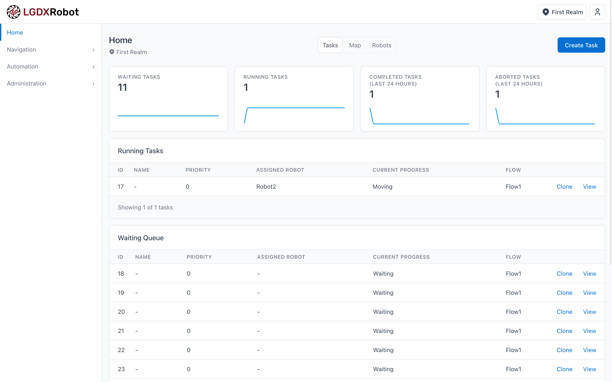

# LGDXRobot Cloud



> Please note that development is primarily done on GitLab: https://gitlab.com/yukaitung/lgdxrobot2-cloud

LGDXRobot Cloud is a robot management system for Automated Guided Vehicles (AGVs), designed with a focus on flexibility and security. It can monitor the status of robots in real-time and manage automated tasks for transportation and logistics. The system is also designed to support easy integration with third-party services and workflows. It integrates seamlessly with the [LGDXRobot2](https://lgdxrobot.bristolgram.uk/lgdxrobot2/) robot, providing a solid foundation for a robotics solution.

- [Homepage](https://lgdxrobot.bristolgram.uk/cloud/)
- [Documentation](https://docs.lgdxrobot.bristolgram.uk/cloud/)

## Features

- Real-time management of robots, including status monitoring and task automation
- Multi-fleet management with waypoint and traffic control
- Email notifications for incidents and alerts
- Integration of third-party web services and hardware with customisable workflows
- User management with role-based or fine-grained access control
- Enhanced security:
  - Two-factor authentication for users
  - Certificate-based authentication for robots
  - Optional hardware protection
- API key management for third-party services

## Tech Stack

The system is built using the .NET framework, with ASP.NET Web API for the backend and Blazor for the frontend. It also utilises RabbitMQ for message queuing and PostgreSQL for database management. Communication between the system and the robot is handled using gRPC. An example client can be found in [LGDXRobot2-ROS2](https://gitlab.com/yukaitung/lgdxrobot2-ros2).

The solution consists of the following projects:

- `LGDXRobotCloud.API`: Backend API for data management, task distribution, and access control
- `LGDXRobotCloud.UI`: Frontend project providing a real-time user interface
- `LGDXRobotCloud.Worker`: Background services for time-consuming tasks such as sending email notifications - or calling external APIs
- `LGDXRobotCloud.Data`: Contains database schema definitions and migrations, as well as Data Transfer Objects (DTOs) and internal models
- `LGDXRobotCloud.Utilities`: Common functions and constants shared across other projects

## Getting Started

LGDXRobot Cloud includes a `Doceker/docker-compose` setup for easy deployment in development and testing environments. You will need Docker with Docker Compose, Git, and OpenSSL installed.

To get started:

```bash
cd Doceker/docker-compose/certs
# Option 1: Run the script to generate the certificates
# Option 2: Run the commands manually in the script
chmod -x ./generate-certs.sh
./generate-certs.sh
```

After running the script, the console will display the serial number/thumbprint of the certificate. Copy the value (after the `=` symbol) and paste it into the relevant `appsettings.json` files in the `Doceker/docker-compose` folder.

Then, start the environment:

```bash
cd ..
docker-compose up
```

Wait for the console to display the message: `data-1 exited with code 0`. This indicates that the database has been initialised and the API is ready. Alternatively, you can check whether the `docker-compose-data-1` container has terminated.

To access the frontend, open: [https://localhost:5103/](https://localhost:5103/)

The default username and password is `admin` / `123456`.

### Full Integration with LGDXRobot2 on Simulation

[https://lgdxrobot.bristolgram.uk/get-started/](https://lgdxrobot.bristolgram.uk/get-started/)

### Robot Integration (Testing with Postman)

To test robot integration using Postman:

1. Make sure a robot has been created and that you have saved its Root Certificate, Public Key, and Private Key.
2. Import the `LGDXRobotCloud.API/Protos/RobotClientsService.proto` file into Postman.
3. Add the certificate (targeting localhost:5162) to Postman.

To authenticate the robot:

1. Call the `greet` method with example data to receive a Bearer Token.
2. Call the `exchange` method with the token and the following status `{ "RobotStatus": 0 }`.

If successful, the robot will appear as online in the frontend.

## Notes About Docker

To pull the image from Docker Hub, you can either use the latest tag or specify a particular version number, such as 1.0.0. Please refer to the [releases](https://gitlab.com/yukaitung/lgdxrobot2-cloud/-/releases) page for the version history. All images support both amd64 and arm64 architectures.

## License

This project is licensed under the MIT Licence.

## Notes For Developers

API client generation relies on Kiota. To generate the client for the `LGDXRobotCloud.UI` project, with the `LGDXRobotCloud.API` project running, use the following command:

```bash
kiota generate -l CSharp -c LgdxApiClient -n LGDXRobotCloud.UI.Client -o ./Client -d https://localhost:5163/openapi/v1.json --clean-output
```
