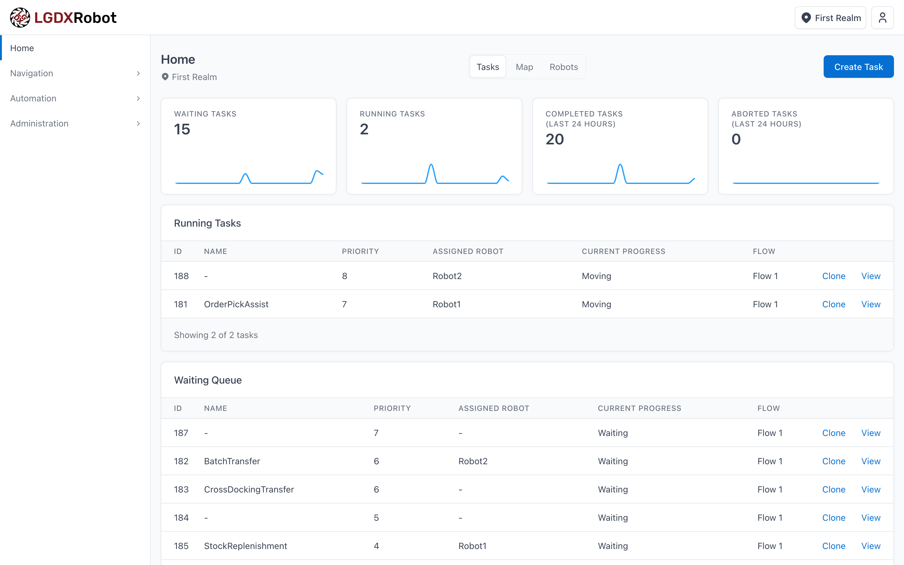
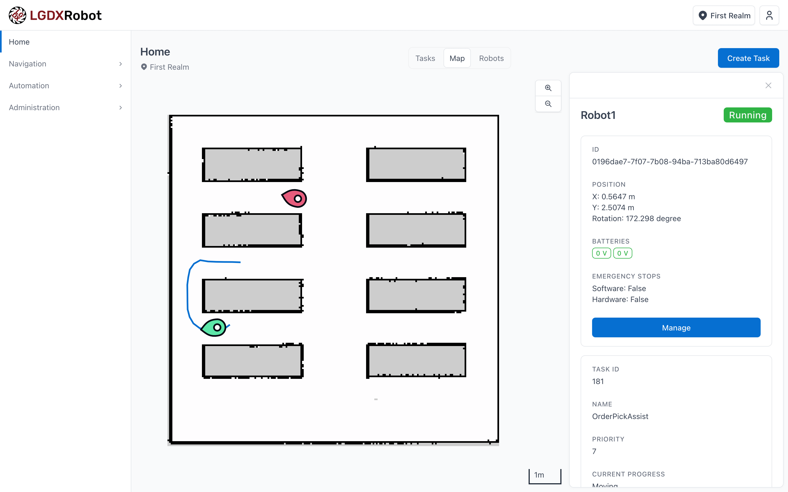
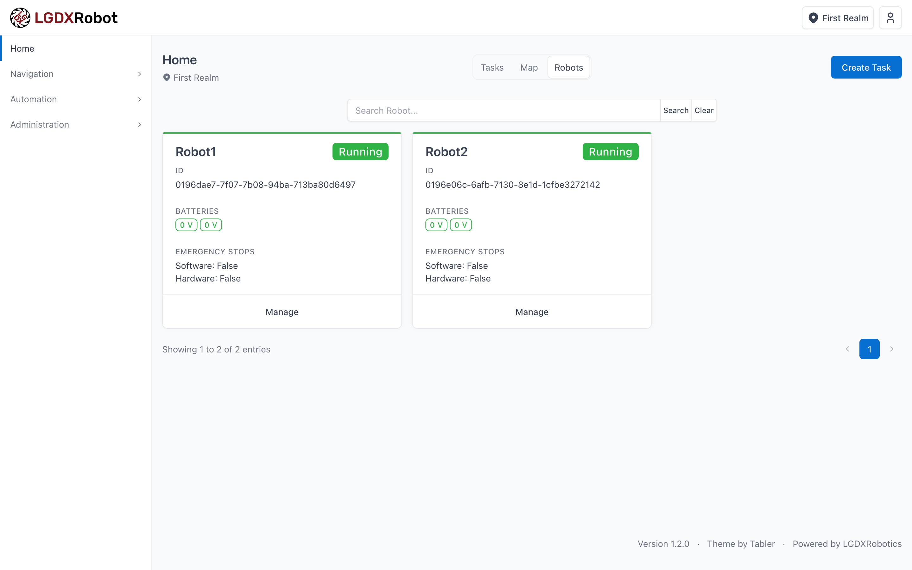
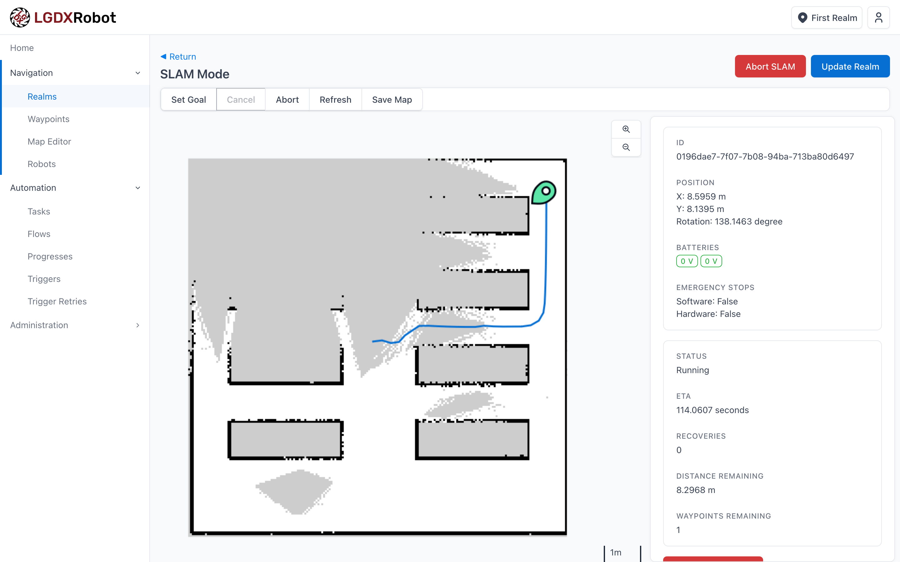

# LGDXRobot Cloud



> Please note that development is primarily done on GitLab: https://gitlab.com/lgdxrobotics/lgdxrobot-cloud

## Overview

LGDXRobot Cloud is a robot management system for Automated Guided Vehicles (AGVs), designed with a focus on flexibility and security. It can monitor the status of robots in real-time and manage automated tasks for transportation and logistics. The system is also designed to support easy integration with third-party services and workflows. It integrates seamlessly with the [LGDXRobot2](https://lgdxrobot.bristolgram.uk/lgdxrobot2/) robot, providing a solid foundation for a robotics solution.

- [Homepage](https://lgdxrobot.bristolgram.uk/cloud/)
- [Documentation](https://docs.lgdxrobot.bristolgram.uk/cloud/)

## Features

- **Real-Time Management**: Manage robot statuses and task processes through a real-time web interface.
- **United Solution Setup**: Generate maps with SLAM, register robots, and manage operations using the same system.
- **Multi-Fleet Management**: Manage multiple fleets of robots with waypoint navigation and traffic control.
- **Email Notifications**: Receive notifications for incidents and alerts, with customisable recipients.
- **Seamless Integration**: Customisable workflows allow integration with third-party web services and hardware.
- **User Management**: Create users and define permissions based on roles or fine-grained access control.
- **Security Features**:
  - Two-factor authentication with a mobile app for user login.
  - Certificate-based authentication for robots.
  - Optional hardware-level protection via serial number validation.
- **API Key Management**: Manage API keys to control third-party service access to the system.

## Screenshots

Monitor robot locations on a map, highlighting the selected robot along with its status and planned path.



Monitor robot statuses on a page.



Generate maps using SLAM.



## Tech Stack

The system is built using the .NET, with ASP.NET Web API for the backend and Blazor for the frontend.

It also utilises RabbitMQ for reliable message queuing to the worker service, Redis for robot data aggregation, and PostgreSQL for database management.

Communication between the system and the robot is handled using gRPC. An example client can be found in [LGDXRobot2-ROS2](https://gitlab.com/yukaitung/lgdxrobot2-ros2).

The solution consists of the following projects:

- `LGDXRobotCloud.API`: Backend API for data management, task distribution, and access control
- `LGDXRobotCloud.UI`: Frontend project providing a real-time user interface
- `LGDXRobotCloud.Worker`: Background services for time-consuming tasks such as sending email notifications or calling external APIs
- `LGDXRobotCloud.Data`: Contains database schema definitions and migrations, as well as Data Transfer Objects (DTOs) and internal models
- `LGDXRobotCloud.Utilities`: Common functions and constants shared across other projects

### Full Setup Instructions

For users who want to set up and customise the system for their specific needs.

[https://docs.lgdxrobot.bristolgram.uk/cloud/](https://docs.lgdxrobot.bristolgram.uk/cloud/)

### Fast Setup

For users who want to get up and running quickly with the system only.

LGDXRobot Cloud includes a `Docker/docker-compose` setup for easy deployment in development and testing environments. You will need Docker with Docker Compose, Git, and OpenSSL installed.

To get started:

```bash
cd Docker/docker-compose/certs
# Option 1: Run the script to generate the certificates
# Option 2: Run the commands manually in the script
chmod -x ./generate-certs.sh
./generate-certs.sh
```

After running the script, the console will display the serial number/thumbprint of the certificate. Copy the value (after the `=` symbol) and paste it into the relevant `appsettings.json` files in the `Docker/docker-compose` folder.

Then, start the environment:

```bash
cd ..
docker-compose up
```

Wait for the console to display the message: `data-1 exited with code 0`. This indicates that the database has been initialised and the API is ready. Alternatively, you can check whether the `docker-compose-data-1` container has terminated.

To access the frontend, open: [https://localhost:5103/](http://localhost:5102/)

The default username and password is `admin` / `123456`.

## Notes About Docker

To pull the image from Docker Hub, you can either use the latest tag or specify a particular version number, such as 1.0.0. Please refer to the [releases](https://gitlab.com/yukaitung/lgdxrobot2-cloud/-/releases) page for the version history. All images support both amd64 and arm64 architectures.

## License

This project is licensed under the MIT Licence.

## Notes For Developers

API client generation relies on Kiota. To generate the client for the `LGDXRobotCloud.UI` project, with the `LGDXRobotCloud.API` project running, use the following command:

```bash
kiota generate -l CSharp -c LgdxApiClient -n LGDXRobotCloud.UI.Client -o ./Client -d https://localhost:5163/openapi/v1.json --clean-output
```
